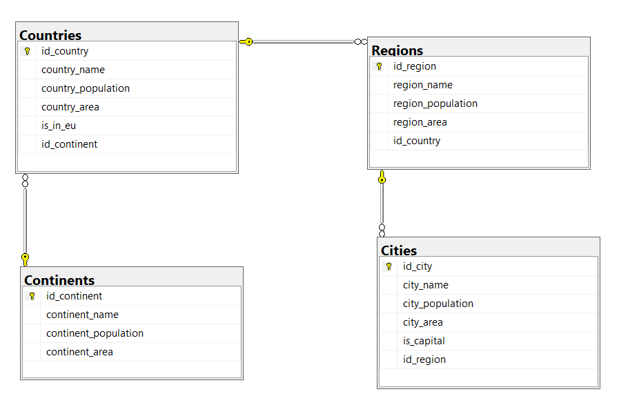
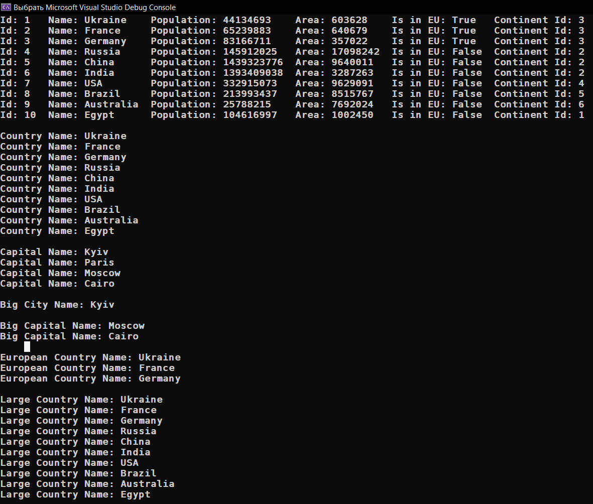
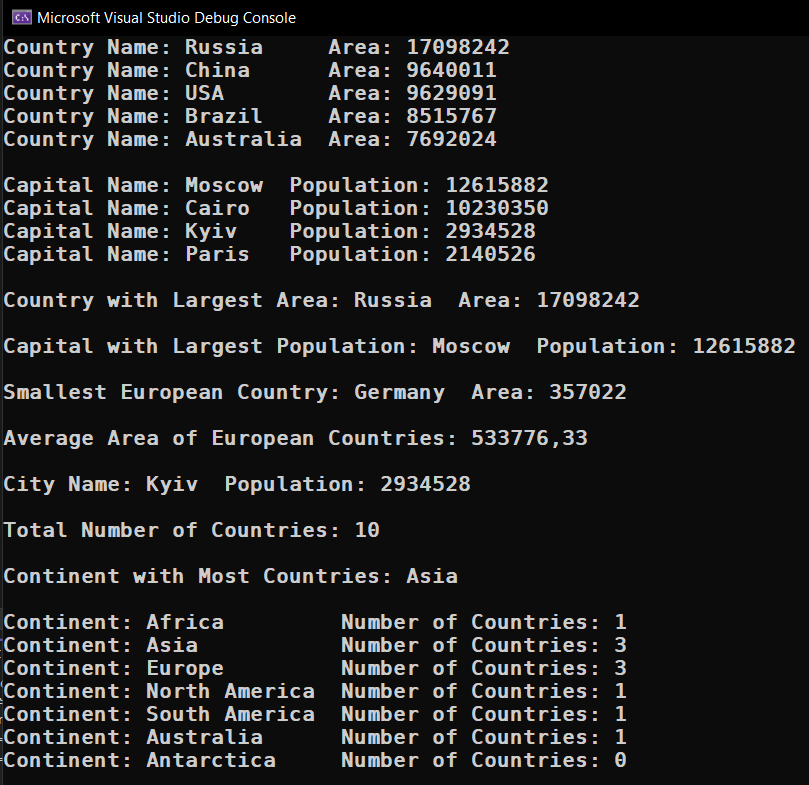

# Module 5.1

<table>
  <tr>
    <h2>Task 1-2</h2>
    <a href="Task_1-2/Program.cs">-> Task_1-2.cs - code</a>
    <td></td>
  </tr>
  <tr>
    <td></td>
  </tr>
</table>

<table>
  <tr>
    <h2>Task 3</h2>
    <a href="Task_3/Program.cs">-> Task_3.cs - code</a>
    <td></td>
  </tr>
</table>

<table>
  <tr>
    <h2>Task 4</h2>
    <a href="Task_4/Program.cs">-> Task_4.cs - code</a>
    <td></td>
  </tr>
</table>
